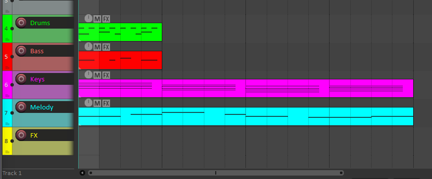

# Scythe MCP — REAPER Integration

AI-powered music composition and control for REAPER DAW via Model Context Protocol.

## 🎵 Features

- **OSC Control**: Transport, tempo, volume, pan, mute/solo
- **MIDI Generation**: Create tracks, items, and notes programmatically  
- **execute_lua**: Full REAPER control via ReaScript
- **Music Theory**: Scales, chords, progressions, rhythm patterns

## 📸 Demo



*5 tracks created via MCP: Drums, Bass, Keys, Melody, FX — each with MIDI patterns and colors*

## 🚀 Quick Start

### 1. Install Python dependencies

```bash
cd d:/tareas/experiment_cubase
uv sync
```

### 2. Configure REAPER OSC

1. **Preferences** → **Control/OSC/Web** → **Add**
2. Select **OSC (Open Sound Control)**
3. Configure:
   - Mode: **Local port**
   - Port: **8000**
   - Local IP: **192.168.0.3** (your local IP)

### 3. Load the Lua script

1. Copy `scythe_mcp/reascript/scythe_poller.lua` to REAPER Scripts
2. **Actions** → **Load ReaScript** → Run

### 4. Add to MCP config

```json
{
  "mcpServers": {
    "scythe": {
      "command": "uv",
      "args": ["run", "scythe-mcp"],
      "cwd": "d:/tareas/experiment_cubase"
    }
  }
}
```

## 🛠️ Available Tools

| Tool | Description |
|------|-------------|
| `play`, `stop`, `record` | Transport control |
| `set_tempo(bpm)` | Change project tempo |
| `create_track(name)` | Create new track |
| `set_track_volume(track, vol)` | Set volume (0-1) |
| `mute_track`, `solo_track` | Mute/solo toggle |
| `execute_lua(code)` | Run any Lua in REAPER |

## 📁 Project Structure

```
scythe_mcp/
├── server/
│   ├── main.py           # MCP server with tools
│   └── reaper_bridge.py  # OSC + file-based commands
├── reascript/
│   ├── scythe_poller.lua # REAPER Lua client
│   └── install.md        # Setup guide
├── music_theory/
│   ├── scales.py         # 15+ scales and modes
│   ├── chords.py         # Chord construction
│   ├── progressions.py   # Genre-specific progressions
│   └── rhythm.py         # Time signatures, swing
└── generators/
    ├── drums.py          # Drum patterns
    ├── basslines.py      # Bass generators
    └── melodies.py       # Melody generators
```

## 🎹 Example: Create a Lo-fi Beat

Ask the AI:
> "Create a lo-fi track at 85 BPM with jazzy chords and a dreamy melody"

What gets created:
- 5 tracks (Drums, Bass, Keys, Melody, FX) with colors
- Chord progression: Cmaj7 → Am7 → Fmaj7 → G7
- Melody notes on the Melody track
- ReaSynth loaded on each track

## 📜 License

MIT
